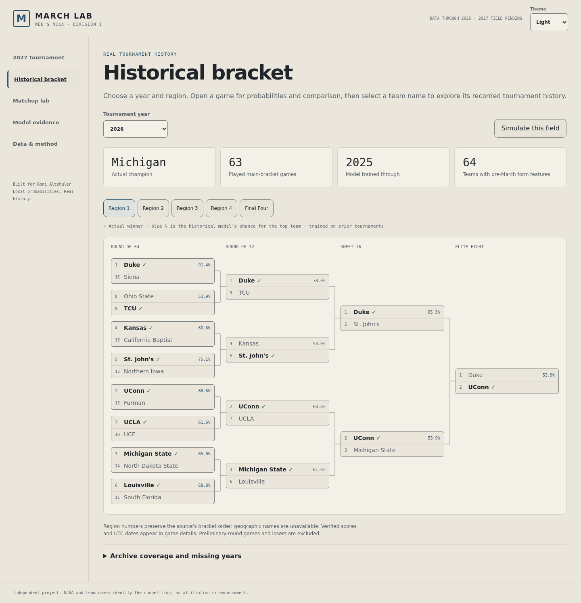

# March Lab

Men's NCAA Division I tournament probabilities, a real historical bracket archive,
and an interactive browser app. Built for Roni Altshuler and the upcoming
2027 tournament. Independent project; no NCAA affiliation.

[Open March Lab](https://roni-altshuler.github.io/march_madness_predictor/).
The public app works without a backend. See the verified [release record](docs/RELEASE.md).

The 2027 field is **unknown**. The published format has **76 teams and 12 Opening
Round games** feeding a 64-team bracket. This project does not invent entrants.
The official schedule lists Selection Sunday March 14, Opening Round March 16–17,
and the Detroit Final Four April 3 and 5.
[NCAA schedule](https://www.ncaa.com/news/basketball-men/article/2026-05-07/2027-march-madness-mens-ncaa-tournament-schedule-dates).

## Run locally

Python 3.11+ is recommended. No Node packages, API key, Kaggle account or paid
service is required. The checked-in archive, features and trained artifacts work
offline after installing dependencies.

```powershell
python -m venv .venv
.\.venv\Scripts\python.exe -m pip install -r requirements.txt
.\.venv\Scripts\python.exe -m madness serve
```

Open **http://127.0.0.1:8027**. On macOS/Linux, replace the Python executable with
`.venv/bin/python`. The server binds to localhost.

The UI includes year and region navigation, interactive bracket graphs, matchup
details with available scores and dates, team comparisons, historical model
snapshots, exact advancement probabilities, reproducible bracket draws, a seed
matchup explorer, calibration and evaluation tables. It adapts to mobile and
supports keyboard operation. Its bracket-first navigation follows familiar
tournament conventions, with its own branding and no copied NCAA assets.
On mobile, a round selector gives a readable matchup list. On desktop/tablet,
the connected bracket scrolls inside its own frame.

The model evidence page includes a **Season evidence** inspector. Choose a year
to see played labels, score/date coverage, pre-March feature coverage, the saved
seed model's training and calibration horizons, and per-model evaluation scores.
Open that year's bracket directly from the inspector. Warm-up years, unavailable
form snapshots and cancelled 2020 are explicit; missing evaluations stay as
dashes. Feature availability does not imply that a form model could be trained
on enough earlier games. The inspector reads bundled artifacts without refitting
or promoting a challenger, and works in both local and static builds.
Its cream surfaces, warm neutral cards, clear bracket action and visible primary
model callout sit within March Lab's original dark navigation. Focus outlines,
responsive score tables and reduced-motion-aware control transitions support
keyboard and mobile exploration. Loading, cancelled and retry states remain
explicit rather than displaying old or invented scores.
[Desktop inspector](docs/screenshots/season-evidence-desktop.png) ·
[Mobile inspector](docs/screenshots/season-evidence-mobile.png).

Team names in historical game details open a **team tournament profile**. Browse
recorded appearances, seeds, final stages, opponents and available scores/dates,
then return to the originating bracket, region and game. The same journey works
with keyboard navigation, the mobile round list and the exported static app.
Recorded-appearance links always open actual results. Archive controls keep the
URL aligned with the displayed year, region and view for browser Back/Forward.
The latest sampled draw per year survives browsing other seasons during the
session; reloading switches to explicitly labeled actual results.
The cream/navy profile uses text initials; no team logos or player portraits are
downloaded, and rosters/player statistics are unavailable.

Modern appearances join only through the existing per-season verified ESPN IDs.
Older records use a separate exact archive-key namespace and do not contribute
to modern school totals. Similar names never establish identity: the archive
label `SanDiego` represents San Diego in 2008 and UC San Diego in 2025;
`Lafayette` represents Lafayette in 2015 and Louisiana in 2023. Profiles keep
these verified identities separate and offer clearly scoped related-record
links. Appearance counts, titles and played wins–losses describe only that
profile's bundled main-bracket records, not a complete school career.
No-contests are listed separately; cancelled 2020, missing years and failed
loads remain explicit. No sources, model fitting or prediction claims change.
[Desktop profile](docs/screenshots/team-profile-desktop.png) ·
[Mobile profile](docs/screenshots/team-profile-mobile.png).

Matchup Lab also includes a **recorded matchup comparison**. Open it from actual
game details, or choose an archived year and matchup in the lab. Three cards show
the saved seed baseline and eligible challengers for the same game, with both
teams' numeric probabilities, training horizons and percentage-point gaps from
the baseline. Swap the displayed team sides, follow their existing histories,
inspect that year's evidence or open the actual bracket. Browser Back/Forward
preserves the comparison selection; simulated game details remain distinct.

Warm-up snapshots, the 2006 form-coverage/model-availability boundary, cancelled
2020 and no-contests stay explicit. Missing probabilities are dashes, and model
gaps are not confidence intervals or evidence that a challenger is better. The
feature reuses native controls, the season-evidence theme, profile links and the
existing prediction API/static tables. It adds no UI dependencies, assets,
sources, training or model promotion.
[Desktop comparison](docs/screenshots/matchup-comparison-populated-desktop.png) ·
[Mobile comparison](docs/screenshots/matchup-comparison-populated-mobile.png).

Team profiles also include a **historical scouting dossier** for the selected
recorded appearance. Elo, win rate and scoring margin show March 1 values and
percentiles among covered entrants in that tournament. The lookback control
compares the last 3, last 5 or all earlier appearances in the same stored identity:
recorded wins versus the sum of saved seed probabilities on those same matchups.
Current and later tournament results are excluded from that earlier-results signal.

This is descriptive evidence on observed paths, not expected full-bracket wins,
national team rankings, player value or a future strength forecast. Missing form,
warm-up models, no-contests, missing identities and cancelled appearances remain
explicit; no confidence interval is estimated. The dossier reuses existing
features and strictly earlier-trained annual snapshots without fitting or
promoting a model. Source schedules may be incomplete, and old archive keys are
kept separate from verified modern school identities.
The field cohort is conditional on preliminary-round survivors; the dossier
is retrospective context, not a selection-day full-field forecast.
[Desktop dossier](docs/screenshots/team-scouting-populated-desktop.png) ·
[Mobile dossier](docs/screenshots/team-scouting-populated-mobile.png).

The whole navigation journey shares March Lab's blue/gold identity and palette:
cream/off-white light surfaces or a dark workspace. The header's **Theme** control
offers System, Light and Dark. The choice is initialized before styles render,
saved locally when storage is available, and carried through the bracket, matchup
details, profiles/scouting, comparisons, evidence, method and request states.
System follows changes to the device preference; an explicit choice overrides it.
Blocked storage keeps the current visit usable but cannot persist a choice.

[Light desktop](docs/screenshots/theme-home-light-desktop.png) ·
[Light mobile](docs/screenshots/theme-home-light-mobile.png) ·
[Dark profile](docs/screenshots/theme-profile-dark-mobile.png) ·
[Dark comparison](docs/screenshots/theme-comparison-dark-desktop.png).



## Actual coverage

| Layer | Included | Explicit gaps |
|---|---|---|
| Main-bracket archive | 41 tournaments, 1985–2026; 2,583 advancements | 1939–1984 absent; 2020 cancelled; preliminary games/losers absent |
| Played model labels | 2,582 games | Oregon–VCU 2021 no-contest excluded |
| Modern scores/dates | All 1,259 played main-bracket games in 2006–2026 excluding 2020 | Scores/dates before 2006 absent; venues/geographic region names absent |
| Pre-March team features | All 64 main-bracket teams in each of 20 seasons, 2006–2026 excluding 2020 | No pre-2006 form features; no claim of complete NCAA regular-season coverage |
| Team tournament profiles | Published modern ESPN-ID records; separate uncrosswalked exact archive-key records | No complete-career aggregation, rosters, player statistics or qualification history |
| 2027 field | Format and dates; no entrants | Actual teams, seeds and opening placements await announcement |

The archive comes from
[possibly-wrong/ncaa-tournament](https://github.com/possibly-wrong/ncaa-tournament),
Unlicense, pinned commit `036bc619ab30705476da9a420279c4d177365e7d`.
Modern schedules come from **SportsDataverse hoopR-mbb-data authors**, upstream
ESPN, [CC BY 4.0](https://creativecommons.org/licenses/by/4.0/).
We adapt schedules into pre-March features and verify archive scores/results.
Attribution, URLs, hashes, measured counts and reviewed name corrections appear
in [DATA.md](docs/DATA.md) and `data/derived/`. Raw schedule caches are ignored.

## Measured prediction record

Annual expanding-window evaluation. Each test tournament uses only earlier
tournaments for fitting and earlier out-of-fold predictions for calibration.
Development: 1995–2019. Chronological rolling holdout: 2021–2026, **377 games**.
Later holdout years may train on earlier holdout years, never their own outcomes.
This is a retrospective evaluation, inspected during development; there is no
prospective accuracy claim.

| Forecaster | Brier ↓ | Log loss ↓ | ECE ↓ |
|---|---:|---:|---:|
| 50/50 | 0.25000 | 0.69315 | 0.00000 |
| Fixed seed heuristic: 75% to better seed | 0.20474 | 0.60011 | 0.03249 |
| **Seed logistic · primary** | **0.19358** | **0.56876** | **0.03484** |
| Seed curve challenger | 0.19072 | 0.56242 | 0.03735 |
| Pre-March form challenger | 0.19392 | 0.56965 | 0.03813 |

All rows cover the same 377 holdout games. The primary is an interpretable,
symmetric ridge-logistic seed model. The curve adds a log-seed ratio. The form
model adds within-season Elo, win rate and mean margin, frozen **March 1 at
00:00 UTC**, plus selection-time seeds. It is not a selection-day statistics
model and does **not** improve the seed baseline in this holdout.

The curve's Brier gain is small and its tournament-cluster bootstrap interval
includes zero. The primary stays the seed model. Six test tournaments provide
limited evidence; older data is not a guarantee of 2027 skill. No injuries,
rosters, transfer data or market benchmark are included.
See [MODEL.md](docs/MODEL.md), the app's evidence page and
`artifacts/evaluation.json` for per-year/round metrics, reliability bins and paired
uncertainty. A perfectly calibrated 50/50 forecaster can have no useful discrimination.

## Reproduce training and inference

```powershell
# Uses bundled real labels and derived pre-tournament features; no network
python -m madness train
python -m madness predict --a 5 --b 12
python -m madness predict --a 5 --b 12 --model seed_curve

# Uses the 2026 model snapshot fitted only on tournaments through 2025
python -m madness simulate --year 2026 --rng 42 --output artifacts/simulation.json

# Optional: fully regenerate labels, source-derived features and score enrichment
python -m madness ingest
python -m madness schedules --start 2006 --end 2026
python -m madness train
```

Use the virtual environment's Python executable for these commands. Optional
downloads total roughly 15 MB across 20 Parquet files. Each asset is capped at
10 MB and downloads use at most four threads. Recorded SHA-256 hashes are checked;
changed upstream files require an explicit `--refresh-source` and reevaluation.
Source releases can change; the bundled derived features preserve this measured
version even if an old raw asset is no longer available.

## Import a real bracket

Import JSON through the 2027 page, or use:

```powershell
python -m madness simulate --field data/imports/announced_2027.json --rng 42
```

See [FIELD_FORMAT.md](docs/FIELD_FORMAT.md). The simulator validates ordered
regions, unique teams, same-seed opening pairs and the announced 2027 counts.
It computes exact advancement odds and one seeded random bracket. Historical
simulations are **conditional on the 64 main-bracket participants**, after
preliminary games, rather than full-field Selection Sunday forecasts.

## Verification

```powershell
python -m pytest -q
node --check web/app.js
node --check web/theme.js
node --check web/static_api.js
node --check web/season_insights.js
node --check web/team_profiles.js
node --check web/team_scouting.js
node --check web/matchup_compare.js
python -m pip install -r requirements-dev.txt
python tests/browser_check.py
python -m madness export
python tests/browser_check.py --static
```

Browser checks use installed Microsoft Edge. On other systems, change the
Playwright channel or install Chromium. See [VERIFICATION.md](docs/VERIFICATION.md).

Project code: MIT. Third-party data keeps its original licenses, recorded in
`licenses/`. No Kaggle data, credentials or user imports are committed. Public publication follows the authorized review and verification workflow.

## Static public build

`python -m madness export` writes the deployable app to ignored `public/`.
It publishes probability tables computed by the trained Python models. The
browser reads those values, aggregates valid bracket paths and draws a seeded
bracket. It does not fit coefficients or invent a second probability model.
Python/static parity tests cover seed, curve, form and a 76-team structural
fixture. The static app works under a project subpath and requires no backend.
GitHub Pages publication is authorized for this project; the release record
contains the verified public URLs and CI status.
